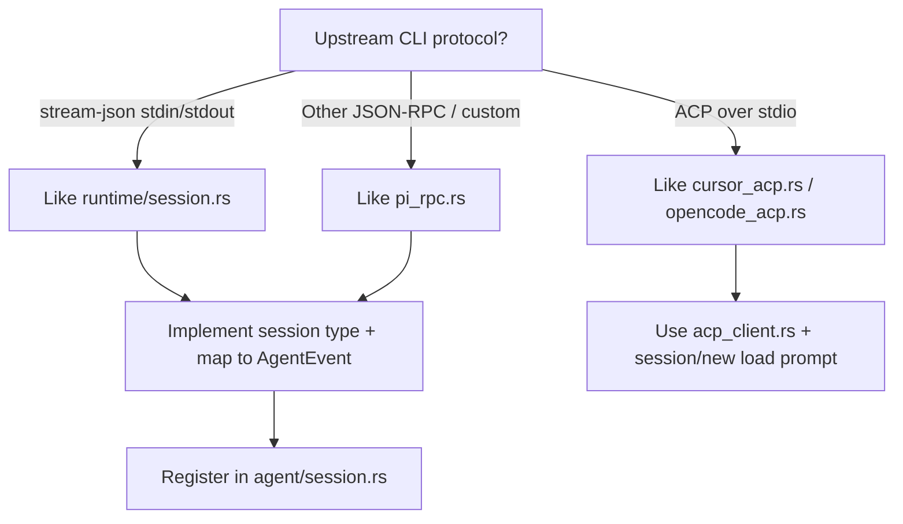
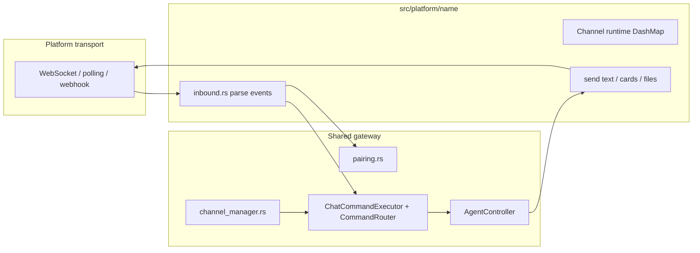

# CLAUDE.md

This file provides guidance to Claude Code (claude.ai/code) when working with code in this repository.

## Project Overview

cc-gateway is a Rust gateway that exposes local agent sessions to remote users via chat bot platforms (Feishu/Lark, Telegram, QQ) and an interactive local CLI / WebUI. It spawns provider CLIs (e.g. `claude`, Cursor `agent acp`, `opencode acp`), communicates over stdin/stdout, and bridges messages between the provider and external interfaces.

## Project Structure

This is a **frontend/backend split** project:

- **Backend** (this repo): Rust gateway with Axum HTTP server. Embeds the WebUI static files via `rust-embed` (`src/web/handlers/ui.rs` → `webui/dist/`).
- **Frontend** (separate repo): React 18 + Vite + TypeScript. Lives at `../cc-gateway-webui` (or clone from `https://github.com/caixy-plus/cc-gateway-webui.git`).

Workflow: edit frontend → `npm run build` in `cc-gateway-webui` → copy `dist/` into this repo's `webui/dist/` → rebuild Rust binary.

Notes:
- The frontend repo is expected to be a **sibling directory** (one level up from this repo). If `../cc-gateway-webui` is missing, clone it first.
- If `webui/dist/` is missing (or not embedded in the Rust binary), the WebUI will show a fallback page indicating the frontend artifacts were not embedded.
- The WebUI frontend (`../cc-gateway-webui`) is an **auxiliary repo** for this project. Before cutting a release tag, ensure any WebUI changes have been **committed and pushed** in the frontend repo; the release workflow builds the frontend from that repo, so unpushed changes will not be included in the release artifacts.
- **NEVER commit `webui/dist/`** — it is gitignored (`webui/.gitignore`: `dist/`) and exists only as a **local build artifact** for local packaging/embedding. The release workflow `rm -rf`s and rebuilds it from the frontend repo, so committing it is pointless and noisy. When committing backend changes, only stage `src/`, `Cargo.toml`, etc. — never `git add -f` or otherwise force dist files. The legacy force-added dist files have been untracked; do not re-add them.
- **No manual rebuild/integration of `webui/dist/` is needed.** Do not hand-run `npm run build` + copy `dist/` just to "integrate" the frontend. Integration is automatic:
  - **Local**: `./install_local.sh` builds the frontend (`npm run build` in `../cc-gateway-webui`), refreshes `webui/dist/`, then `cargo build --release` embeds it.
  - **Release**: the CI workflow checks out and builds the frontend repo and copies it into `webui/dist/` before compiling.
  - So after editing the frontend, just commit/push the **frontend repo** and run `./install_local.sh` (local) or push a tag (release) — never commit `webui/dist/` to wire it up.

## Local Development Install

Platform-specific scripts that build from source (including the frontend) and install locally:

- **macOS / Linux**: `./install_local.sh`
- **Windows**: `powershell -ExecutionPolicy Bypass -File .\install_local.ps1`

Production install scripts (download pre-built binaries from GitHub Releases):
- **macOS / Linux**: `./install.sh`
- **Windows**: `.\install.ps1`

## Build & Test

```sh
cargo build --release     # Release build
cargo build               # Debug build
cargo test                # Run all tests
cargo test <module>       # Run tests matching name (e.g., cargo test router)
cargo run                 # Run interactive CLI mode
cargo run -- start        # Start daemon (spawns background process)
```

## Development Principles

- **Response language (AI assistants in this repo)**: Write final summaries, explanations, PR descriptions, and handoff messages in the **same language as the user’s initial request** that states the task or change (e.g. a bug report or feature ask). You may think and draft internally in English, but the user-visible conclusion must not switch languages unless the user does. Infer language from that first substantive message; if it is mixed or unclear, default to **Chinese (简体中文)**. This rule applies to assistant ↔ user communication only—not to product UI copy (see [Internationalization](#internationalization-i18n)).
- **No autonomous git or release actions**: Do **not** commit, push, open PRs, bump `Cargo.toml` version, push tags, run release/install scripts to publish, or create or edit GitHub Releases unless the user **explicitly asks** in the current thread (e.g. “commit”, “push”, “发版”, “打 tag”). Finishing code or tests is not permission to ship. If shipping seems appropriate, list the exact commands or steps and wait for confirmation.
- **Use TDD for feature work and bug fixes**: write or update a focused failing test first, implement the smallest change that makes it pass, then refactor with tests green.
- **Run tests based on change scope**: after functional changes, choose the fastest relevant test set from the touched modules and risk area instead of defaulting to full `cargo test` every time. Run full tests when changes touch shared infrastructure, cross-platform behavior, persistence, command/session lifecycle, or before final verification of broad refactors.
- **Document skipped verification**: if a change is docs-only or tests are intentionally not run, say so in the final response.
- **Release tagging must match Cargo version** (only when the user requests a release): before pushing a release tag `vX.Y.Z`, ensure `Cargo.toml` `[package].version` is exactly `X.Y.Z`. The release workflow enforces this and will fail if they differ.
- **Version bump rule (project convention)**: use `MAJOR.MINOR.PATCH`.
  - `PATCH` ranges **0–9**. When it reaches **9**, the next bump rolls over to `0` and increments `MINOR`.
  - `MINOR` ranges **0–19**. When it reaches **19**, the next bump rolls over to `0` and increments `MAJOR`.
  - Example: `1.5.9` → `1.6.0`; `1.19.9` → `2.0.0`.
- **Release notes must be bilingual** (only when the user requests a release): when creating a GitHub Release (or editing one), write release notes with each bullet in both Chinese and English, separated by ` / `. Format: `- **中文描述** / English description — 中文细节 / English details.` This applies to both manually created and CI-created releases. If CI creates the release with auto-generated notes, edit it afterwards via `gh release edit`. Never leave only the auto-generated "Full Changelog" link as the sole body — the WebUI shows release notes directly to users, and empty notes waste the update-check feature.
- **Update user docs with the code**: adding or materially changing an **agent provider** or **chat platform** is not complete until the [user-facing documentation](#user-facing-documentation-keep-in-sync) checklist below is satisfied (English + Chinese where paired files exist). Do not ship integration-only PRs without the matching `docs/` and README updates.
- **Chat platform integration**: follow [docs/platform-integration-checklist.md](docs/platform-integration-checklist.md) (feature parity matrix + A–E checklist). Copy into PRs; check every required row.

## User-facing documentation (keep in sync)

Treat documentation as part of the feature. When reviewers (or release prep) grep for a new `id`, it should appear in setup guides—not only in Rust/WebUI code.

### New agent provider

| File | What to update |
|------|----------------|
| `docs/config.md` / `docs/config.zh-CN.md` | `agent` fields, example JSON, defaults; link to provider CLI install if non-obvious |
| `README.md` / `README.zh-CN.md` | Provider name in features / gateway-command provider list / quick start when behavior differs |
| `CLAUDE.md` | § [Adding a New Agent Provider](#adding-a-new-agent-provider) — refresh “Current providers” line; optional note under Agent Runtime if protocol is new |
| `src/i18n/dict.rs` | Provider-specific user strings (see i18n rules below) |

No `docs/bots/` change unless the provider is only relevant on one platform (unusual).

### New chat platform (bot channel)

| File | What to update |
|------|----------------|
| `docs/bots/<platform>.md` / `docs/bots/<platform>.zh-CN.md` | **Create** setup guide: developer console steps, `config.json` fields, pairing, transport, UX (`/ll`, @ rules), **whether MCP `send_file` is supported**, troubleshooting, official API links |
| `docs/bots/README.md` / `docs/bots/README.zh-CN.md` | Add row to the platform table; mention pairing if applicable |
| `docs/config.md` / `docs/config.zh-CN.md` | New `GatewayConfig` section, field table, example JSON, restart vs live fields; link to `docs/bots/<platform>` |
| `docs/usage.md` / `docs/usage.zh-CN.md` | Usage section for that platform (how to talk to the bot, command quirks) |
| `README.md` / `README.zh-CN.md` | Features, architecture line, quick-start platform table, documentation index table |
| `scripts/install-docs.sh` / `scripts/install-docs.ps1` | Add EN + zh-CN URL lines (install scripts source these; do not duplicate URLs in `install.sh` / `install.ps1`) |
| `CLAUDE.md` | Project Overview; Platform layer; § [Adding a New Chat Platform](#adding-a-new-chat-platform-bot); **§ [Platform Reference Docs](#platform-reference-docs)** — add official vendor URLs (required, see that section) |
| `../cc-gateway-webui` | Settings / pairing / session source labels (see platform frontend checklist in that section) |

### Conventions

- **Bilingual pairs**: every new `docs/foo.md` user guide should have `docs/foo.zh-CN.md` (or live under `docs/bots/*.zh-CN.md`). README uses `README.md` + `README.zh-CN.md` with language links at the top.
- **Single source for setup steps**: long console walkthroughs live in `docs/bots/<platform>.md`; `docs/config.md` and README only summarize fields and link there.
- **Install output**: `install.sh` / `install.ps1` / `install_local.*` call `scripts/install-docs.*` — extend those scripts when adding a platform so fresh installs list the new guide.

## Architecture

### Entry Points

- **`src/main.rs`**: CLI entry. Uses `clap` subcommands. No subcommand → interactive mode (`cli::interactive::run_interactive`). `start`/`stop`/`restart`/`log`/`status`/`enable`/`disable` manage the daemon. `_daemon` is the hidden command that actually runs the engine.
- **`src/cli/interactive.rs`**: Local REPL using `rustyline`. Spawns an async event listener that prints Claude responses with ANSI boxes, and a readline loop that feeds input into `CommandRouter`. Provides `Tab` completion and grey inline hints for `/` commands via `CommandHelper`.

### Daemon Lifecycle (`src/daemon/`)

- **`daemon/mod.rs`**: PID-file-based daemon management with triple singleton lock: port binding (configurable via `port`), `.daemon-starting.lock` for `start()` atomicity, and PID file `flock` held for daemon lifetime. `start()` spawns a detached child running `cc-gateway _daemon`. `stop()` sends SIGTERM (Unix) or `taskkill` (Windows). `run()` loads config, writes PID file, and starts `DaemonEngine`.
- **`daemon/engine.rs`**: Core async engine. Starts all enabled `Platform` integrations (`feishu.enabled`, `telegram.enabled`, `qq.enabled`) concurrently, then waits for shutdown signal (SIGTERM/SIGINT). On shutdown, calls `platform.shutdown()` on each enabled platform to gracefully terminate all active chat sessions.

### Agent Runtime (`src/agent/` + `src/runtime/`)

- **`agent/session.rs`**: Provider-neutral `AgentRuntime` enum; dispatches spawn/send/stop/resume to the active backend.
- **`runtime/session.rs`** / **`runtime/protocol.rs`**: Claude Code **stream-json** over stdio.
- **`agent/cursor_acp.rs`**, **`agent/opencode_acp.rs`**: **ACP** JSON-RPC clients (gateway is the ACP *client*; the CLI is the *agent*). Shared helpers: `acp_client.rs`.
- **`agent/pi_rpc.rs`**: Pi **line-delimited JSON-RPC** (`pi --mode rpc`).
- **`runtime/controller.rs`**: Owns the active `AgentRuntime`, exposes start/stop/send. Emits `ControllerEvent` (Text, Thinking, ToolUse, ToolResult, PermissionRequest, Error, Done). Manages `work_dir`, MCP attach context, and pending permission/resume state.

### Command Routing (`src/command/`)

- **`command/router.rs`**: First line of message handling. When a session is active, gateway controls (e.g. `/quit`) are handled locally; other text is forwarded to the active agent. When inactive, parses builtins (`/help`, `/cd`, `/agent`, `/agents`, `/agent-history`, `/pwd`, `/ll`, `/mkdir`, `/show-thinking`, `/hide-thinking`, `/quit`).
- **`command/builtin.rs`**: Implements gateway commands and help text.
- **`command/forward.rs`**: Forwards regular text as user messages to Claude. Returns an error prompt if no session is active.

### Platform Layer (`src/platform/`)

See **[Adding a New Chat Platform (Bot)](#adding-a-new-chat-platform-bot)** for the full integration checklist. User-facing setup guides: `docs/bots/` (Feishu, Telegram, QQ — EN + zh-CN).

- **`platform/mod.rs`**: Defines the `Platform` trait (`run()` and `shutdown()`). All platform integrations implement this trait so `DaemonEngine` is platform-agnostic.
- **`platform/feishu/mod.rs`**: WebSocket client for Feishu's pbbp2 protocol (protobuf frames). Gets tenant access token, connects to WS endpoint, handles heartbeats, deduplicates messages, normalizes events into `NormalizedMessage`, routes through `CommandRouter`, and polls `AgentController` events to reply back. Each chat gets its own `ChatSession` (isolated Claude subprocess).
  - `/ll` in Feishu is intercepted before routing: sends an interactive card listing folders from `default_dir`. Card buttons carry `value: { "cmd": "cd", "path": "...", "chat_id": "..." }`.
  - `/cd` in Feishu is intercepted before routing: resolves and canonicalizes the path, enforces that the result stays within `default_dir`, then calls `set_work_dir`.
  - Card callbacks with `cmd == "cd"` are handled directly: call `controller.init_work_dir(path)` and reply with confirmation text.
  - Unknown slash commands when no session is active receive a list of available commands (see `feishu.unknown_command`).
- **`platform/telegram/mod.rs`**: Telegram Bot API integration using long-polling `getUpdates`. Each chat gets its own `TgChatSession` (isolated Claude subprocess). Routes messages through `CommandRouter` and streams Claude responses back via `sendMessage`.
- **`platform/qq/mod.rs`**: QQ 开放平台官方机器人（OpenAPI v2 + Gateway WebSocket）。`app_id` / `app_secret` 换取 access token，连接 `wss` Gateway，处理 `C2C_MESSAGE_CREATE` 与 `GROUP_AT_MESSAGE_CREATE`。频道 id：`u:{openid}`（私聊）、`g:{group_openid}`（群 @）。`/ll` 等为纯文本列表（无卡片按钮）。**MCP `send_file`**: `McpDeliveryTarget::Qq` + 富媒体上传/发送（`platform/qq/api.rs`）；群聊仅支持图片/视频/语音，通用文件需私聊。入站仍为纯文本（无 `inbound_media`）。生产 API：`https://api.sgroup.qq.com`；`qq.sandbox: true` 使用沙箱域名。
- **`platform/proto/mod.rs`**: Protobuf frame codec for Feishu pbbp2 (METHOD_CONTROL / METHOD_DATA, SERVICE_IM / SERVICE_CARD).

### Platform Reference Docs

**For implementers** — official vendor API / console links used when building or debugging `src/platform/<name>/`. This section is **not** end-user setup; users read `docs/bots/<platform>.md`.

**When adding a new chat platform, you must update this section** (and mirror the same links under **References** in `docs/bots/<platform>.md` + `.zh-CN.md`):

1. **Console / developer portal** — where to create the app and copy credentials.
2. **Auth** — token, app secret, or bot token docs.
3. **Transport** — the API surface cc-gateway actually uses (WebSocket opcodes, `getUpdates`, webhook, etc.).
4. **Inbound events** — message / callback event names and payloads.
5. **Outbound messages** — send message / card / keyboard APIs.
6. **Optional** — intents, permissions, rate limits, sandbox vs production hosts.

Also refresh § [Adding a New Chat Platform](#adding-a-new-chat-platform-bot) (“Current platforms” line) and the transport table in step **2** if the style is new.

#### Feishu / Lark (`platform/feishu/`)

| Topic | URL |
|-------|-----|
| Open Platform (home) | https://open.feishu.cn/document/home/index |
| Create app (CN console) | https://open.feishu.cn/app |
| Lark (intl console) | https://open.larksuite.com/app |
| Bot long connection / WebSocket | https://open.feishu.cn/document/uAjLw4CM/ukTMukTMukTM/server-side-sdk/golang-sdk-guide/preparations |
| Event `im.message.receive_v1` | Search in Feishu docs for “接收消息” / message events |
| Card JSON v2 overview | https://open.feishu.cn/document/uAjLw4CM/ukzMukzMukzM/feishu-cards/card-json-v2-breaking-changes-release-notes |
| Button component (V2) | https://open.feishu.cn/document/feishu-cards/card-json-v2-components/interactive-components/button |

**cc-gateway:** pbbp2 WebSocket (`platform/feishu/ws.rs`, `platform/proto/`); interactive cards (`platform/feishu/cards.rs`). User guide: [docs/bots/feishu.md](docs/bots/feishu.md).

#### Telegram (`platform/telegram/`)

| Topic | URL |
|-------|-----|
| Bot API reference | https://core.telegram.org/bots/api |
| Long polling `getUpdates` | https://core.telegram.org/bots/api#getupdates |
| `sendMessage` | https://core.telegram.org/bots/api#sendmessage |
| Create bot (BotFather) | https://t.me/BotFather |

**cc-gateway:** HTTP long-polling only (no webhook in tree). User guide: [docs/bots/telegram.md](docs/bots/telegram.md).

#### QQ (`platform/qq/`)

| Topic | URL |
|-------|-----|
| Developer portal (console) | https://q.qq.com/ |
| API v2 wiki (home) | https://bot.q.qq.com/wiki/develop/api-v2/ |
| WebSocket gateway (opcodes, Identify/Resume) | https://bot.q.qq.com/wiki/develop/api-v2/dev-prepare/interface-framework/reference.html |
| Events / intents | https://bot.q.qq.com/wiki/develop/api-v2/dev-prepare/interface-framework/event-emit.html |
| Get WSS URL (`GET /gateway` / `gateway/bot`) | https://bot.q.qq.com/wiki/develop/api-v2/openapi/wss/url_get.html |
| Messages (send/receive) | https://bot.q.qq.com/wiki/develop/api-v2/server-inter/message/send-receive/ |
| Rich media (for future `send_file`) | https://bot.q.qq.com/wiki/develop/api-v2/server-inter/message/send-receive/rich-media.html |
| Access token (`getAppAccessToken`) | Implemented against `https://bots.qq.com/app/getAppAccessToken` (see `platform/qq/api.rs`) |

**cc-gateway:** OpenAPI v2 WebSocket Gateway (`platform/qq/ws.rs`); production API `https://api.sgroup.qq.com`, sandbox `https://sandbox.api.sandbox.qq.com`. User guide: [docs/bots/qq.md](docs/bots/qq.md).

#### MCP `send_file` by platform

Agents can call the gateway MCP tool **`send_file`** (see `runtime/mcp_server.rs`) to push a local file into the **active chat**. This requires:

1. `McpDeliveryTarget::<Platform>(…)` in `runtime/file_delivery.rs` with a `FileDelivery` impl.
2. Platform builds `McpContext { delivery: … }` and passes `ChatCommandContext::with_mcp_context(...)` when starting a session (Feishu/Telegram pattern).
3. Provider supports MCP attach (`agent/mcp_attach.rs` — Claude + ACP providers).

| Platform | MCP `send_file` | Notes |
|----------|-----------------|-------|
| **Feishu** | Yes | Upload + `send_file_message` (`FeishuFileTarget`) |
| **Telegram** | Yes | `sendDocument` multipart (`TelegramFileTarget`) |
| **QQ** | **Yes** (limited) | Rich media upload + `msg_type` 7 (`QqFileTarget`). **Group:** image/video/voice only. **C2C:** also generic files (`file_type` 4). No inbound media forwarding yet. |
| **CLI / WebUI** | N/A | No chat delivery target |

When adding a chat platform, **document** MCP support in this table, `docs/bots/<platform>.md`, and the platform hooks table below. If not implemented on day one, state it explicitly so users do not expect agent file push.

#### User-facing setup guides

End-user / operator walkthroughs: **`docs/bots/`** (EN + `*.zh-CN.md` per platform), index [docs/bots/README.md](docs/bots/README.md). Install scripts list these via `scripts/install-docs.*`.

### Configuration (`src/config/`)

- **`config/loader.rs`**: Loads `~/.cc-gateway/config.json` with `${VAR}` environment variable substitution.
- **`config/model.rs`**: `GatewayConfig` with `log`, `agent` (provider profiles), `feishu`, `telegram`, `qq`, plus top-level fields like `port`, `default_dir`, `show_thinking`, `media_retention_days`.
- **`config/wizard.rs`**: Interactive setup via `cc-gateway init` (also editable in WebUI Settings).

### Web Server (`src/web/`)

- **`web/server.rs`**: Axum HTTP server bound to `config.port` (replaces the old throwaway TCP singleton listener). Serves the embedded WebUI static files and exposes REST APIs.
- **`web/handlers/ui.rs`**: Static file handler using `rust-embed` to serve the compiled frontend from `webui/dist/` at the root path.
- **`web/handlers/session.rs`**: Session APIs — `GET /api/sessions`, `POST /api/sessions`, `DELETE /api/sessions/:id`, `POST /api/sessions/:id/messages`, `GET /api/sessions/:id/history`, `GET /api/sessions/:id/events` (SSE stream for real-time messages).
- **`web/handlers/cmd.rs`**: Gateway command APIs — `POST /api/cmd/ll`, `/api/cmd/pwd`, `/api/cmd/cd`, `/api/cmd/cd_default`.
- **`web/handlers/config.rs`**: Config APIs — `GET /api/config` (includes `agents` catalog), `POST /api/config`, `GET /api/agents` (integrated provider list + per-profile settings), `GET /api/platforms`.
- **`web/handlers/system.rs`**: System APIs — `GET /api/version`, `POST /api/restart`.
- **CORS**: Configured to allow `127.0.0.1` and `localhost` origins; no auth required (local-only access).

### Session Management (`src/session/`)

- **`session/manager.rs`**: `SessionManager` holds all sessions in a `DashMap<String, Session>`. WebUI sessions also have a `WebUISessionRuntime` (controller + router) stored separately. `GLOBAL_SESSIONS` is the process-wide singleton.
- **`session/model.rs`**: `Session` struct with `id`, `source` (`WebUI` / `Feishu` / `Telegram`), `platform`, `chat_id`, `title`, `work_dir`, `active`, `provider_session_id`, `created_at`.
- **Persistence**: All sessions are persisted to SQLite (`src/db/`). On daemon restart, previously active sessions are marked inactive because their Claude subprocesses are gone.

### History Recording

- Events are written to `~/.cc-gateway/history/{session_id}.jsonl`.
- A broadcast channel (`EVENT_BUS`) fans out `ControllerEvent` to both the SSE stream and the history recorder.
- Each line: `{"timestamp": "...", "role": "user|assistant|system", "content": "...", "event_type": "..."}`.

### Database (`src/db/`)

- SQLite backend storing sessions, config overrides, and runtime state. Auto-creates tables on first access.

### Update / Version Check (`src/update/`)

- Checks GitHub Releases (`caixy-plus/cc-gateway`) for newer versions. Used by the WebUI version badge and can be triggered from the sidebar.

### Provider Session ID & Resume

- Claude Code: after spawning the `claude` subprocess, cc-gateway reads `~/.claude/sessions/{pid}.json` to extract Claude's internal session id, persists it as `provider_session_id`, and uses it to resume when supported.
- Cursor / OpenCode ACP: `session/load` with persisted `provider_session_id`, fall back to `session/new` when missing.
- Pi: no durable resume in cc-gateway; `/agent-history` resume and `clear_session` start a **new** provider session (see `session_restarted_message` / Pi hint in `command/agents.rs`).

## Adding a New Agent Provider

Use this checklist when wiring a new CLI/agent into cc-gateway. Current providers: **Claude** (stream-json), **Cursor** & **OpenCode** (ACP), **Pi** (RPC). Pick the integration style that matches the upstream CLI. **Also complete** § [User-facing documentation](#user-facing-documentation-keep-in-sync) (agent provider table).

### 1. Choose an integration style



| Style | Reference module | Spawn pattern | MCP `send_file` |
|-------|------------------|---------------|-----------------|
| Stream-json | `runtime/session.rs` | `claude --input-format stream-json …` | `--mcp-config` via `mcp_attach::build_claude_mcp_servers_object` |
| ACP | `agent/cursor_acp.rs`, `agent/opencode_acp.rs` | e.g. `agent acp`, `opencode acp` | `session/new` `mcpServers` via `mcp_attach::build_acp_mcp_servers` |
| Custom RPC | `agent/pi_rpc.rs` | Provider-specific argv | Add `ProviderMcpSupport` when upstream supports it |

### 2. Backend checklist (this repo)

| Step | File(s) | What to add |
|------|---------|-------------|
| **A. Identity & config** | `src/config/model.rs` | New `AgentProvider` variant; field on `AgentProfiles` (e.g. `myagent: AgentProviderConfig`); `Display` / `parse_str`; `Default for AgentProfiles`; `default_for_provider()`; `is_provider_enabled()` + `config_for_provider()` match arms; `runtime_defaults()` disable flag if needed; `normalized()` / arg stripping if the CLI rejects Cursor/Claude-only flags. |
| **B. Protocol implementation** | `src/agent/<name>.rs` (new) | `spawn(work_dir, extra_args, config, event_tx, resume_session_id, mcp_context?)` → `(Session, Option<provider_session_id>)`; `send_message`, `stop` / `force_stop`, permission/cancel/stop-generation as required; map provider output → `AgentEvent` (`agent/event.rs`). Reuse `agent::passthrough_env()`; resolve binary with `runtime::session::resolve_cli_path`. |
| **C. Module export** | `src/agent/mod.rs` | `pub mod <name>;` |
| **D. Runtime dispatch** | `src/agent/session.rs` | New `AgentRuntime` variant; extend **every** `match self` arm: `spawn`, `send_message`, `flush_queued_messages`, `send_stop_generation`, `new_provider_session`, `send_input`, `stop`, `force_stop`, `is_alive`, `recent_stderr`, and any provider-only hooks. |
| **E. MCP attach** | `src/agent/mcp_attach.rs` | `provider_mcp_support()` → `ClaudeMcpConfig` \| `AcpSession` \| `Unsupported`; tests in `mcp_attach` tests module. Wire `mcp_context` in spawn from `AgentController` (already passed for supported providers). |
| **F. User-facing registry** | `src/config/agent_registry.rs`, `src/command/agents.rs` | Add `AgentProviderDef` in registry; `available_providers()` / `provider_display_name()` read from it; optional `session_restarted_message` / idle hints. |
| **G. `/agent` prefix** | `src/command/router.rs` | Uses `agent_registry::parse_provider_id()` (includes `slash_aliases` when needed). |
| **H. Init wizard** | `src/config/wizard.rs`, `agent_registry::apply_init_agent_enablement` | Menu from `AGENT_PROVIDER_DEFS`; after picking default: **installed → enabled**, **uninstalled → disabled** except the chosen default (enabled even if missing CLI). |
| **I. i18n** | `src/i18n/dict.rs` | Keys for provider-specific `/stop`, `/esc`, errors, resume notices (`builtin.*`, `<provider>.*`, etc.) — **both** `Language::En` and `Language::ZhCN`. |
| **J. Optional quirks** | e.g. `command/builtin.rs`, `runtime/controller.rs`, `runtime/event_poller.rs` | Resume/history rules (`/agent-history`), auto-approve tool names (`is_gateway_send_file_tool`), turn-done buffering for streaming ACP, `ensure_under_home` for `cwd`. Only touch when behavior differs from existing providers. |
| **K. ACP shared** | `acp_client.rs` | New ACP agents: reuse `AcpClient`, `build_acp_mcp_servers`; set `initialize` capabilities consistently with what you implement. |
| **L. Tests** | `src/tests/config_model.rs`, `command_router.rs`, `agent_controller.rs`, `src/agent/<name>.rs` or `src/tests/<name>.rs` | Defaults, `/agent <provider>`, spawn argv normalization, MCP matrix; register module in `src/tests/mod.rs`. Prefer TDD: failing test → minimal impl. |
| **U. Documentation** | See § [User-facing documentation](#user-facing-documentation-keep-in-sync) | `docs/config` (+ zh-CN), `README` (+ zh-CN), refresh “Current providers” in this section. |

Platforms (Feishu/Telegram/QQ/WebUI/CLI) generally **do not** need per-provider code: they use `AgentProfiles`, `CommandRouter`, and `AgentController`. Feishu agent picker options come from `command::agents::available_providers()` via `build_agent_picker_card` — no card change unless UX needs a new layout.

### 3. Agent registry & WebUI (no per-provider frontend edits)

**Single source of truth:** `src/config/agent_registry.rs` — `AGENT_PROVIDER_DEFS` lists every integrated provider (`id`, `display_name`, `cli_binary`, `slash_aliases`). Wire this when adding a provider:

| Step | File | What to add |
|------|------|-------------|
| **M. Registry** | `src/config/agent_registry.rs` | One `AgentProviderDef` entry (same `id` as `config.json` key). |
| **N. API** | (automatic) | `GET /api/agents` and `GET /api/config` field `agents` expose the catalog + current `enabled` / `default_args` per provider. |

Refactor `command/agents.rs` and `parse_provider_prefix` to use the registry — do **not** duplicate provider lists elsewhere.

**Frontend (`../cc-gateway-webui`)** — settings UI is **dynamic**:

- `GET /api/agents` → `{ default, providers: [{ id, display_name, cli_binary, aliases, config }] }`
- `SettingsModal` loads the catalog and renders default-agent `<select>` + enable/args rows from `providers[]`
- `GatewayConfig.agent` is typed as `{ default: string }` plus dynamic provider keys; no hard-coded `settings.agent_claude` keys

Optional: `GET /api/config` also includes an `agents` object (same shape) so one request can hydrate the modal.

Commit and push the **frontend repo** only when changing WebUI behavior; local `./install_local.sh` rebuilds and embeds `webui/dist/`.

### 4. Config shape (for reference)

`config.json` → `agent`:

```json
{
  "default": "claude",
  "claude": { "enabled": true, "default_args": "", "mode": "agent", "permission": "prompt" },
  "cursor": { "enabled": false },
  "pi": { "enabled": false },
  "opencode": { "enabled": false }
}
```

`AgentConfig` at runtime is built by `AgentProfiles::config_for_provider()` (merges profile overrides, `--yolo` semantics, `normalized()`). Users enable providers with `enabled: true` and pick defaults via `/agents` or WebUI settings.

### 5. Verification

1. `cargo test agent_registry config_model command_router agent_controller` (+ new module tests).
2. `cc-gateway init` wizard lists the new binary; `enabled` / `apply_init_agent_enablement` behave as expected.
3. Interactive: `/agents` → set default; `/agent <alias> [args]` in a work dir; message round-trip, `/stop`, `/esc`, permission prompts.
4. Feishu/Telegram: `/agent` picker, start session, MCP `send_file` round-trip. QQ: same flow but **no** `send_file` until `McpDeliveryTarget::Qq` exists.
5. WebUI: `GET /api/agents` lists the new provider; Settings → Agent shows it without frontend code changes (after `./install_local.sh` or release build).
6. **Docs**: § [User-facing documentation](#user-facing-documentation-keep-in-sync) checklist done (config + README + this file).

### 6. Naming conventions

- **Config / JSON / DB**: lowercase provider id (`cursor`, `opencode`) — `AgentProvider::to_string()`.
- **User aliases**: optional short tokens for `/agent` via `slash_aliases` in `agent_registry`.
- **Display names**: `agent_registry` `display_name` (may differ from config `id`).

## Adding a New Chat Platform (Bot)

Use this checklist when integrating a new chat bot (Feishu/Lark, Telegram, QQ, Discord, Slack, etc.). **Full checklist (do not skip items):** [docs/platform-integration-checklist.md](docs/platform-integration-checklist.md).

Current platforms: **Feishu** (pbbp2 WebSocket + cards), **Telegram** (Bot API long-polling), **QQ** (OpenAPI v2 Gateway WebSocket). Unlike agents, there is **no** `platform_registry` yet — several files still use explicit `feishu` / `telegram` / `qq` match arms (noted below). **Also complete** § [User-facing documentation](#user-facing-documentation-keep-in-sync) and Platform Reference Docs.

### 1. Architecture (what you are building)



**Contract:** implement `Platform` (`run` + `shutdown`). Per-chat state lives in a `*ChannelRuntime` (see `FeishuChannelRuntime`, `TelegramChannelRuntime`). **Do not** reimplement `/agent`, `/cd`, session DB, or agent spawning — route through shared code.

| Layer | Responsibility | Reuse |
|-------|----------------|--------|
| **Transport** | Connect, heartbeat, receive/send API calls | New code per vendor API |
| **Inbound** | Normalize vendor payload → text / callbacks / media | `platform/inbound_media.rs` helpers |
| **Outbound** | Chunk long replies, typing indicators, errors | Copy patterns from Feishu/Telegram constants |
| **Commands** | Slash commands, permissions, agent events | `ChatCommandExecutor`, `CommandRouter`, `EventPollSink` |
| **Sessions** | One `ChannelSession` per chat; optional `AgentSession` | `GLOBAL_CHANNEL_SESSIONS` |
| **Pairing** | Optional admin approval for new chats | `GLOBAL_PAIRING_MANAGER` keyed by `platform` string |

### 2. Choose a connection style

| Style | Reference | When |
|-------|-----------|------|
| **WebSocket + custom framing** | `platform/feishu/ws.rs`, `platform/proto/` | Vendor pushes events over WS (Feishu pbbp2 protobuf) |
| **HTTP long-polling** | `platform/telegram/mod.rs` | Simple Bot API `getUpdates` loop |
| **WebSocket (JSON opcodes)** | `platform/qq/ws.rs` | Vendor Gateway (QQ Bot API v2: Hello / Identify / Dispatch) |
| **Webhook server** | (not in tree yet) | Vendor POSTs to your HTTP endpoint; run handler inside `Platform::run` |

Pick one transport; keep vendor JSON/API types inside `src/platform/<name>/` only.

### 3. Backend checklist (this repo)

| Step | File(s) | What to add |
|------|---------|-------------|
| **A. Config** | `src/config/model.rs` | New `XxxConfig { enabled, require_pairing, …credentials }` on `GatewayConfig`; `Default`; `runtime_defaults()` disables it until init. |
| **B. Config save/load** | `src/config/loader.rs` | Legacy upgrade in `upgrade_config_json` if you rename fields. |
| **C. Restart policy** | `src/config/restart_policy.rs` | `daemon_restart_field_paths()` for `xxx.enabled`, secrets; `live_field_paths()` for `xxx.require_pairing` if it applies without restart; `assess_*` diff functions. |
| **D. Platform module** | `src/platform/<name>/` | `mod.rs`: `struct XxxPlatform`, `impl Platform`. Submodules typical: `inbound.rs`, `handle.rs` or `ws.rs`, optional `cards.rs` / keyboards for interactive UI. |
| **E. Export** | `src/platform/mod.rs` | `pub mod <name>;` |
| **F. Daemon** | `src/daemon/engine.rs` | If `config.<name>.enabled`, construct platform, `tokio::spawn(platform.run())`, push into `platforms` vec for shutdown; `GLOBAL_PAIRING_MANAGER.set_require_pairing("<name>", …)` on startup. |
| **G. Connection status** | `src/platform/status.rs` | `set_state` / `get_state` for WebUI sidebar (today: static atoms per platform). |
| **H. Session source** | `src/session/channel_model.rs`, `src/db/mod.rs` | `SessionSource` variant + `source_to_str` / `str_to_source` for SQLite. |
| **I. Channel mapping** | `src/session/channel_manager.rs` | `get_or_create_platform_channel`: map `platform` string → `SessionSource`. |
| **J. Pairing** | (usually no code) | Use platform id string (`"feishu"`, `"telegram"`) in `require_pairing` / `is_approved` / `get_or_create_pending`. |
| **K. Command bridge** | Platform `mod.rs` loop | Build `ChatCommandContext` (include `McpContext` when agent can `send_file`); call `ChatCommandExecutor::execute`; handle `ChatCommandOutcome` (reply, `ListDir`, `SelectAgent`, permission prompts, etc.). |
| **L. Agent events** | Platform poll loop | `runtime/event_poller.rs` + `EventPollSink` impl (see `TelegramEventSink`) to stream `AgentEvent` → chat messages. |
| **M. MCP `send_file`** | `src/runtime/file_delivery.rs`, `runtime/mcp_server.rs`, platform `mcp_context_for_*` | New `McpDeliveryTarget` variant + `FileDelivery` impl; `with_mcp_context` on inbound. Update MCP matrix + `docs/bots/<platform>.md` limits. |
| **N. Deliver bus** | `platform/mod.rs` | `spawn_deliver_listener("<name>", \|chat_id, text\| …)` if WebUI/daemon pushes files into chats. |
| **O. Interactive UX** | e.g. `feishu/cards.rs`, Telegram inline keyboards | Platform-specific: `/ll` dir picker, `/agent` provider picker, session history cards, permission buttons. Feishu intercepts some commands **before** `CommandRouter` (see Architecture above). |
| **P. Web API** | `src/web/handlers/config.rs` | Mask secrets in `handle_get_config`; merge body in `handle_save_config`; include in `handle_get_platforms` when `enabled`; extend `handle_set_require_pairing` allowlist. |
| **Q. Init wizard** | `src/config/wizard.rs` | `configure_bot_step`: menu entry, enable flag, credential prompts, incomplete warnings. |
| **R. i18n** | `src/i18n/dict.rs` | Prefix `<name>.` for help, errors, shutdown notice, permission titles, command menu labels. |
| **S. Tests** | `src/tests/<name>_*.rs`, `src/tests/mod.rs` | Card/layout unit tests (Feishu), flow tests with mocks, pairing if special-cased. Register module in `tests/mod.rs`. |
| **T. Platform Reference Docs** | `CLAUDE.md` § [Platform Reference Docs](#platform-reference-docs) | **Required:** add a new `#### <Platform>` subsection with console + auth + transport + events + send APIs (table of URLs). Mirror links in `docs/bots/<platform>.md` **References**. |
| **U. User documentation** | See § [User-facing documentation](#user-facing-documentation-keep-in-sync) | **Required:** new `docs/bots/<platform>.md` + `.zh-CN.md`, update `docs/bots/README`, `docs/config`, `docs/usage`, README, `scripts/install-docs.*`. |

**Shared command path (do not fork):** inbound text → `CommandRouter::route` (or `ChatCommandExecutor` for channel-scoped actions) → `AgentController` when a session is active. Gateway builtins (`/help`, `/agent`, `/cd`, …) live in `command/builtin.rs` + `session/channel_command.rs`.

### 4. Platform-specific hooks (common)

| Feature | Feishu | Telegram | QQ | Your platform |
|---------|--------|----------|-----|----------------|
| Pairing gate | `require_pairing` + WebUI approve | same | same | Call `GLOBAL_PAIRING_MANAGER` before handling |
| `/ll` directory UI | Interactive card + callbacks | Text list | Text list | Map `ChatCommandOutcome::ListDir` |
| `/agent` picker | Card buttons `set_agent` | Text list | Text list | Map `ChatCommandOutcome::SelectAgent` |
| Permission prompts | Card / text + callback | Inline buttons | Text + request id | Map `PermissionRequest` events |
| **MCP `send_file`** | Yes (`FeishuFileTarget`) | Yes (`TelegramFileTarget`) | Yes (`QqFileTarget`, group limits) | `McpDeliveryTarget` + `with_mcp_context` |
| Shutdown notice | `feishu.shutdown_notice` i18n | `telegram.shutdown_notice` | `qq.shutdown_notice` | Send on daemon `Platform::shutdown` |
| Unknown slash (no session) | `feishu.unknown_command` | Telegram help text | (shared builtins) | Reply with available commands |

### 5. Frontend checklist (`../cc-gateway-webui`)

Platforms are **not** dynamically listed yet (unlike `GET /api/agents`). Expect manual UI updates:

| File | Change |
|------|--------|
| `src/types/index.ts` | `GatewayConfig.<platform>` block; extend `SourceFilter` if sessions should filter by source. |
| `src/components/SettingsModal.tsx` | Enabled toggle, credential fields, `require_pairing` checkbox. |
| `src/components/PairingModal.tsx` | Displays `platform` from API — usually works if backend uses consistent id string. |
| Sidebar / platforms panel | Reads `GET /api/platforms` — ensure `handle_get_platforms` returns your platform when enabled. |
| `src/i18n/en.ts`, `zh.ts` | `settings.<platform>`, any platform-specific copy. |

Pairing REST (`/api/pairing/*`) is platform-agnostic; config save for `require_pairing` uses `POST /api/platforms/require_pairing` (extend backend allowlist in `handle_set_require_pairing`).

### 6. Config shape (for reference)

```json
{
  "feishu": {
    "enabled": true,
    "app_id": "${FEISHU_APP_ID}",
    "app_secret": "${FEISHU_APP_SECRET}",
    "require_pairing": true
  },
  "telegram": {
    "enabled": false,
    "bot_token": "${TELEGRAM_BOT_TOKEN}",
    "require_pairing": true
  },
  "qq": {
    "enabled": false,
    "app_id": "${QQ_APP_ID}",
    "app_secret": "${QQ_APP_SECRET}",
    "sandbox": false,
    "require_pairing": true
  }
}
```

`${VAR}` substitution happens in `config/loader.rs`. Changing `enabled` or bot credentials requires a **daemon restart**; toggling `require_pairing` applies **live** (see `restart_policy`).

### 7. Init wizard (`cc-gateway init`)

`configure_bot_step` in `wizard.rs`: user picks one bot or skips. Only the chosen platform is enabled; credentials are prompted. Incomplete credentials add wizard warnings. Agent step uses `agent_registry::apply_init_agent_enablement` separately.

### 8. Verification

1. `cargo test <platform>_` modules + `config_model` + `restart_policy`.
2. `cc-gateway init` or WebUI: enable platform, save config, restart daemon.
3. WebUI **Pairing**: approve a test chat when `require_pairing` is on.
4. End-to-end: send message → agent reply; `/agent`, `/cd`, `/ll`, `/quit`; permission allow/deny; MCP `send_file` on Feishu/Telegram (skip for QQ until implemented).
5. `GET /api/platforms` shows `connecting` → `connected`; shutdown sends user-visible notice.
6. `./install_local.sh` if WebUI settings changed.
7. **Docs**: § [User-facing documentation](#user-facing-documentation-keep-in-sync) checklist done; **Platform Reference Docs** subsection added; run install (or `print_install_docs`) and confirm the new guide URL appears.

### 9. Naming conventions

- **Platform id string**: lowercase, stable (`feishu`, `telegram`) — used in DB, pairing, `ChannelSession.platform`, `McpDeliveryTarget`, logs.
- **Display name**: `SessionSource` enum + WebUI (`Feishu`, `Telegram`) — user-facing session list filter.
- **i18n prefix**: match platform id (`feishu.`, `telegram.`).

### 10. Future improvement

A `platform_registry` (like `config/agent_registry.rs`) could drive `DaemonEngine`, `status.rs`, `handle_get_platforms`, and WebUI settings from one list. Until then, grep for existing platform names when adding a new one.

## Testing Patterns

### Terminal UI Tests (`src/command/builtin.rs`)

The `/ll` interactive directory picker is tested without a real terminal by abstracting I/O behind a `SelectBackend` trait:

1. **Trait**: `size()`, `draw(lines)`, `read_key()` — three operations, no crossterm types in business logic.
2. **RealBackend**: Uses `crossterm` for production. Writes `\r\n` (not `\n`) to stdout because raw mode disables automatic newline translation; omitting `\r` causes staircase/diagonal output.
3. **TestBackend**: Records every `draw()` call as `Vec<Vec<String>>` (frames), and replays injected keys. Tests assert exact strings with `==`.
4. **Pure render function**: `render_file_list(items, term_width, term_height, selected) -> (lines, scroll_row)` has no side effects and is tested independently from input handling.

This pattern lets unit tests verify layout math, scroll behavior, selection state, and key navigation with plain string assertions.

## Key Patterns

- **Session switching**: `/agent` starts a session and changes the prompt to `💬 ~/Workspace ▶`. Everything except gateway controls is forwarded to the active agent. `/quit` stops the session in gateway; exits the program when no session is active.
- **Stream-json protocol**: All Claude communication is newline-delimited JSON. Each line is one event. Claude must be launched with `--input-format stream-json --output-format stream-json`.
- **Event channels**: `AgentController` uses an `mpsc::unbounded_channel` to decouple the stdout reader from the consumer (CLI or platform). Consumers poll `recv_event()`.
- **Detached daemon**: The daemon is a separate OS process. `start()` spawns `cc-gateway _daemon` with stdin/stdout/stderr nulled and a new process group (Unix).
- **Config dir**: `~/.cc-gateway/` holds `config.json`, `daemon.pid`, `logs/`, and `skills/`.

## Internationalization (i18n)

Product UI and bot messages (Feishu, Telegram, QQ, CLI, WebUI) are localized via `dict.rs`. For **assistant ↔ user** reply language when editing this repo, see **Response language** under [Development Principles](#development-principles).

All user-facing strings must go through the translation macros in `src/i18n/dict.rs`:

- **Static text**: `crate::t!("module.key")` returns `&str`
- **Formatted text**: `crate::t_fmt!("module.key", NAME = value, ID = id)` returns `String`

### Rules
1. Never hard-code Chinese or English user-visible messages — always add a translation key.
2. Key naming: `{module}.{descriptor}` (e.g. `feishu.permission_title`, `builtin.session_started`, `telegram.shutdown_notice`).
3. Platform-specific keys use the platform prefix (`feishu.`, `telegram.`, `webui.`, `tui.`).
4. Shared / builtin keys use the `builtin.` prefix (`builtin.help`, `builtin.session_stopped`, `builtin.dir_changed`).
5. When adding a new key, provide both English and Chinese (`Language::En` / `Language::ZhCN`) entries in `dict.rs`.
6. Internal debug / tracing messages do not need translation.
