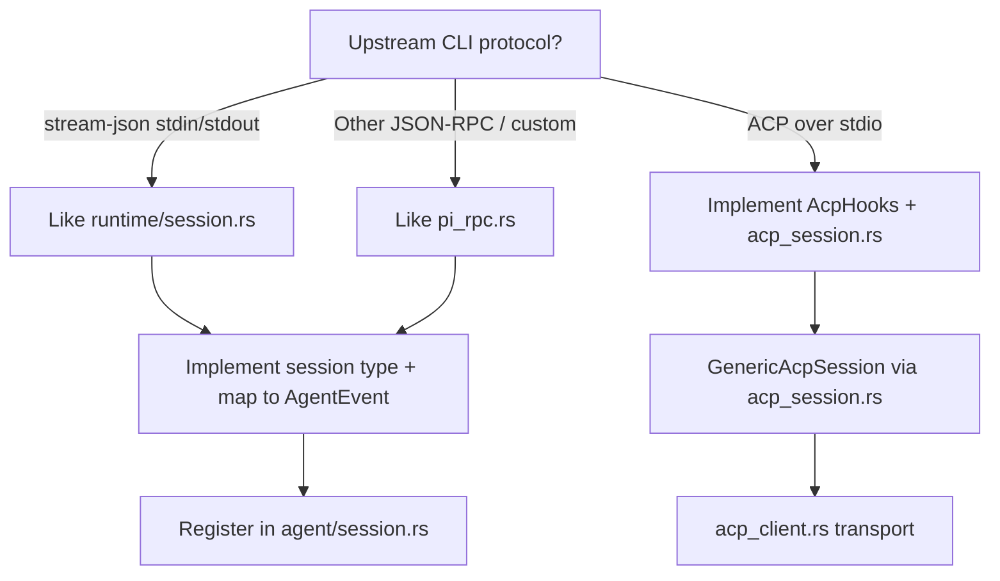

# Adding a New Agent Provider

> Back: [CLAUDE.md](../CLAUDE.md). Companion: [Adding a New Chat Platform](adding-chat-platform.md), [Platform Reference Docs](platform-reference.md).

Use this checklist when wiring a new CLI/agent into cc-gateway. Current providers: **Claude** (stream-json), **Codex** (ACP via `codex-acp`), **Cursor**, **OpenCode**, **Kimi**, **Gemini** & **Qoder** (ACP), **Pi** (RPC). Pick the integration style that matches the upstream CLI. **Also complete** § [User-facing documentation](../CLAUDE.md#user-facing-documentation-keep-in-sync) (agent provider table).

## 1. Choose an integration style



| Style | Reference module | Spawn pattern | MCP `send_file` |
|-------|------------------|---------------|-----------------|
| Stream-json | `runtime/session.rs` | `claude --input-format stream-json …` | `--mcp-config` via `mcp_attach::build_claude_mcp_servers_object` |
| ACP | `agent/acp_session.rs` + thin `agent/<name>.rs` implementing [`AcpHooks`](../../src/core/agent/acp_session.rs) (see `codex_acp.rs`, `cursor_acp.rs`, `opencode_acp.rs`, `kimi_acp.rs`, `gemini_acp.rs`, `qoder_acp.rs`) | e.g. `codex-acp`, `agent acp`, `opencode acp`, `kimi acp`, `gemini --acp`, `qoderclicn --acp` | `session/new` `mcpServers` via `mcp_attach` (`build_acp_mcp_servers` or `prepare_cursor_mcp`) |
| Custom RPC | `agent/pi_rpc.rs` | Provider-specific argv | Add `ProviderMcpSupport` when upstream supports it |

## 2. Backend checklist (this repo)

| Step | File(s) | What to add |
|------|---------|-------------|
| **A. Identity & config** | `src/core/config/model.rs`, `src/core/config/agent_registry.rs` | New `AgentProvider` variant; `AgentProviderDef` + `AgentCapabilities` in registry (`normalize_profiles` seeds `agent.providers.<id>` in the `providers` map — no new struct field); `Display` / `parse_str`; `default_for_provider()`; `normalized()` / arg stripping if the CLI rejects Cursor/Claude-only flags. |
| **B. Protocol implementation** | `src/core/agent/<name>.rs` (new) | **ACP:** implement `AcpHooks` + `pub type MyAcpSession = GenericAcpSession<MyHooks>`; only provider-specific spawn args, MCP prep, auth `methodId`, and extension notifications. **Stream-json / custom RPC:** full session type as before. Map provider output → `AgentEvent` (`agent/event.rs`). Reuse `agent::passthrough_env()`; resolve binary with `runtime::session::resolve_cli_path`. |
| **C. Module export** | `src/agent.rs` | `pub mod <name>;` |
| **D. Runtime dispatch** | `src/core/agent/backend.rs`, `src/core/agent/session.rs` | Implement [`AgentBackend`](../../src/core/agent/backend.rs) on the session type; add one `AgentRuntime` enum variant and one arm in `dispatch_agent_backend!` (spawn/stop/force_stop still match in `session.rs`). Optional capabilities (`set_model`, `compact_context`, `active_model_id`) use trait default errors unless overridden. |
| **E. MCP attach** | `src/core/agent/mcp_attach.rs` | `provider_mcp_support()` → `ClaudeMcpConfig` \| `AcpSession` \| `Unsupported`; tests in `mcp_attach` tests module. Wire `mcp_context` in spawn from `AgentController` (already passed for supported providers). |
| **F. User-facing registry** | `src/core/config/agent_registry.rs`, `src/core/command/agents.rs` | Add `AgentProviderDef` with [`AgentCapabilities`](../../src/core/config/agent_registry.rs) (`session_resume`, `context_compact`, `memory_init`, `platform_bound`, `list_models`, `in_session_model_switch`, `model_arg_passthrough`, `mcp`, …). `provider_supports_*` and MCP matrix read from registry — do not add new hard-coded `match` arms elsewhere. |
| **G. `/agent` prefix** | `src/core/command/router.rs` | Uses `agent_registry::parse_provider_id()` (includes `slash_aliases` when needed). |
| **H. Init wizard** | `src/core/config/wizard.rs`, `agent_registry::apply_init_agent_enablement` | Menu from `AGENT_PROVIDER_DEFS`; after picking default: **installed → enabled**, **uninstalled → disabled** except the chosen default (enabled even if missing CLI). |
| **I. i18n** | `src/utils/i18n/dict.rs` | Keys for provider-specific `/stop`, model switching, errors, resume notices (`builtin.*`, `<provider>.*`, etc.) — **both** `Language::En` and `Language::ZhCN`. |
| **J. Optional quirks** | e.g. `core/command/builtin.rs`, `core/runtime/controller.rs`, `core/runtime/event_poller.rs` | Resume/history rules (`/agent-history`), auto-approve tool names (`is_gateway_send_file_tool`), turn-done buffering for streaming ACP, `ensure_under_home` for `cwd`. Only touch when behavior differs from existing providers. |
| **K. ACP shared** | `acp_session.rs`, `acp_client.rs` | New ACP agents: implement `AcpHooks` (see `CursorAcpHooks` / `OpenCodeAcpHooks`); shared spawn/prompt/permission/update logic lives in `GenericAcpSession`. Transport: `AcpClient`. MCP: `build_acp_mcp_servers` or `prepare_cursor_mcp` per provider. |
| **L. Tests** | Same-file `#[cfg(test)]` in touched modules; optional `src/tests/<name>_*.rs` for end-to-end spawn/MCP flows | Unit tests (defaults, argv normalization, MCP matrix, `/agent` parsing) live **at the bottom of the `.rs` under test** — do not `pub` helpers for cross-file unit tests. Add `src/tests/` only when you need fake CLIs, DB, or session globals; register in `src/tests.rs`. Prefer TDD: failing test → minimal impl. |
| **U. Documentation** | See § [User-facing documentation](../CLAUDE.md#user-facing-documentation-keep-in-sync) | `docs/config` (+ zh-CN), `README` (+ zh-CN), refresh “Current providers” in this section. |

Platforms (Feishu/Telegram/WebUI) generally **do not** need per-provider code: they use `AgentProfiles`, `CommandRouter`, and `AgentController`. Feishu agent picker options come from `command::agents::available_providers()` via `build_agent_picker_card` — no card change unless UX needs a new layout.

## 3. Agent registry & WebUI (no per-provider frontend edits)

**Single source of truth:** `src/core/config/agent_registry.rs` — `AGENT_PROVIDER_DEFS` lists every integrated provider (`id`, `display_name`, `cli_binary`, `slash_aliases`). Wire this when adding a provider:

| Step | File | What to add |
|------|------|-------------|
| **M. Registry** | `src/core/config/agent_registry.rs` | One `AgentProviderDef` entry (same `id` as `agent.providers` key). |
| **N. API** | (automatic) | `GET /api/agents` and `GET /api/config` field `agents` expose the catalog + current `enabled` / `default_args` per provider. |

Refactor `command/agents.rs` and `parse_provider_prefix` to use the registry — do **not** duplicate provider lists elsewhere.

**Frontend (`../cc-gateway-webui`)** — settings UI is **dynamic**:

- `GET /api/agents` → `{ default, providers: [{ id, display_name, cli_binary, aliases, config }] }`
- `SettingsModal` loads the catalog and renders default-agent `<select>` + enable/args rows from `providers[]`
- `GatewayConfig.agent` is typed as `{ default: string, providers: { [id]: profile } }`; no hard-coded `settings.agent_claude` keys

Optional: `GET /api/config` also includes an `agents` object (same shape) so one request can hydrate the modal.

Commit and push the **frontend repo** only when changing WebUI behavior; local `./install_local.sh` rebuilds and embeds `webui/dist/`.

## 4. Config shape (for reference)

`config.json` → `agent`:

```json
{
  "default": "claude",
  "providers": {
    "claude": { "enabled": true, "default_args": "", "mode": "agent", "permission": "prompt" },
    "cursor": { "enabled": false },
    "pi": { "enabled": false },
    "opencode": { "enabled": false },
    "kimi": { "enabled": false },
    "gemini": { "enabled": false }
  }
}
```

`AgentConfig` at runtime is built by `AgentProfiles::config_for_provider()` (merges profile overrides, `--yolo` semantics, `normalized()` via `AgentCapabilities` in the registry). Users enable providers with `enabled: true` and pick defaults via `/agents` or WebUI settings.

On load, `config/loader.rs` runs `upgrade_config_json` (migrates flat `agent.<id>` → `agent.providers.<id>`), `validate_agent_profile_keys` (rejects unknown `agent` / `agent.providers` ids), `normalize_profiles` (adds every registered provider key), and **writes `config.json` back** when the on-disk shape changed. See [config.md](config.md).

## 5. Verification

1. `cargo test agent_registry router smoke_core webui_session` (+ new module tests).
2. `cc-gateway init` wizard lists the new binary; `enabled` / `apply_init_agent_enablement` behave as expected.
3. Interactive: `/agents` → set default; `/agent <alias> [args]` in a work dir; message round-trip, `/stop`, permission prompts.
4. Feishu/Telegram: `/agent` picker, start session, MCP `send_file` round-trip.
5. WebUI: `GET /api/agents` lists the new provider; Settings → Agent shows it without frontend code changes (after `./install_local.sh` or release build).
6. **Docs**: § [User-facing documentation](../CLAUDE.md#user-facing-documentation-keep-in-sync) checklist done (config + README + this file).

## 6. Naming conventions

- **Config / JSON / DB**: lowercase provider id (`cursor`, `opencode`) — `AgentProvider::to_string()`.
- **User aliases**: optional short tokens for `/agent` via `slash_aliases` in `agent_registry`.
- **Display names**: `agent_registry` `display_name` (may differ from config `id`).
