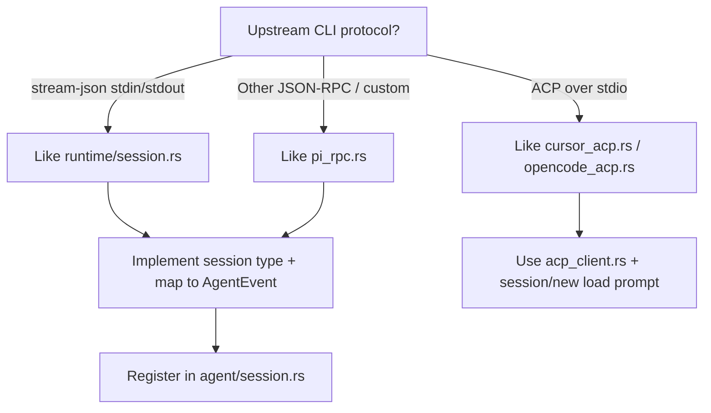

# Adding a New Agent Provider

> Back: [CLAUDE.md](../CLAUDE.md). Companion: [Adding a New Chat Platform](adding-chat-platform.md), [Platform Reference Docs](platform-reference.md).

Use this checklist when wiring a new CLI/agent into cc-gateway. Current providers: **Claude** (stream-json), **Cursor** & **OpenCode** (ACP), **Pi** (RPC). Pick the integration style that matches the upstream CLI. **Also complete** § [User-facing documentation](../CLAUDE.md#user-facing-documentation-keep-in-sync) (agent provider table).

## 1. Choose an integration style



| Style | Reference module | Spawn pattern | MCP `send_file` |
|-------|------------------|---------------|-----------------|
| Stream-json | `runtime/session.rs` | `claude --input-format stream-json …` | `--mcp-config` via `mcp_attach::build_claude_mcp_servers_object` |
| ACP | `agent/cursor_acp.rs`, `agent/opencode_acp.rs` | e.g. `agent acp`, `opencode acp` | `session/new` `mcpServers` via `mcp_attach::build_acp_mcp_servers` |
| Custom RPC | `agent/pi_rpc.rs` | Provider-specific argv | Add `ProviderMcpSupport` when upstream supports it |

## 2. Backend checklist (this repo)

| Step | File(s) | What to add |
|------|---------|-------------|
| **A. Identity & config** | `src/core/config/model.rs` | New `AgentProvider` variant; field on `AgentProfiles` (e.g. `myagent: AgentProviderConfig`); `Display` / `parse_str`; `Default for AgentProfiles`; `default_for_provider()`; `is_provider_enabled()` + `config_for_provider()` match arms; `runtime_defaults()` disable flag if needed; `normalized()` / arg stripping if the CLI rejects Cursor/Claude-only flags. |
| **B. Protocol implementation** | `src/core/agent/<name>.rs` (new) | `spawn(work_dir, extra_args, config, event_tx, resume_session_id, mcp_context?)` → `(Session, Option<provider_session_id>)`; `send_message`, `stop` / `force_stop`, permission/cancel/stop-generation as required; map provider output → `AgentEvent` (`agent/event.rs`). Reuse `agent::passthrough_env()`; resolve binary with `runtime::session::resolve_cli_path`. |
| **C. Module export** | `src/agent.rs` | `pub mod <name>;` |
| **D. Runtime dispatch** | `src/core/agent/session.rs` | New `AgentRuntime` variant; extend **every** `match self` arm: `spawn`, `send_message`, `flush_queued_messages`, `send_stop_generation`, `new_provider_session`, `send_input`, `stop`, `force_stop`, `is_alive`, `recent_stderr`, and any provider-only hooks. |
| **E. MCP attach** | `src/core/agent/mcp_attach.rs` | `provider_mcp_support()` → `ClaudeMcpConfig` \| `AcpSession` \| `Unsupported`; tests in `mcp_attach` tests module. Wire `mcp_context` in spawn from `AgentController` (already passed for supported providers). |
| **F. User-facing registry** | `src/core/config/agent_registry.rs`, `src/core/command/agents.rs` | Add `AgentProviderDef` in registry; `available_providers()` / `provider_display_name()` read from it; optional `session_restarted_message` / idle hints. |
| **G. `/agent` prefix** | `src/core/command/router.rs` | Uses `agent_registry::parse_provider_id()` (includes `slash_aliases` when needed). |
| **H. Init wizard** | `src/core/config/wizard.rs`, `agent_registry::apply_init_agent_enablement` | Menu from `AGENT_PROVIDER_DEFS`; after picking default: **installed → enabled**, **uninstalled → disabled** except the chosen default (enabled even if missing CLI). |
| **I. i18n** | `src/utils/i18n/dict.rs` | Keys for provider-specific `/stop`, `/esc`, errors, resume notices (`builtin.*`, `<provider>.*`, etc.) — **both** `Language::En` and `Language::ZhCN`. |
| **J. Optional quirks** | e.g. `core/command/builtin.rs`, `core/runtime/controller.rs`, `core/runtime/event_poller.rs` | Resume/history rules (`/agent-history`), auto-approve tool names (`is_gateway_send_file_tool`), turn-done buffering for streaming ACP, `ensure_under_home` for `cwd`. Only touch when behavior differs from existing providers. |
| **K. ACP shared** | `acp_client.rs` | New ACP agents: reuse `AcpClient`, `build_acp_mcp_servers`; set `initialize` capabilities consistently with what you implement. |
| **L. Tests** | `src/core/config/*` tests, `src/core/command/router.rs` tests, `src/core/agent/<name>.rs` tests, `src/tests/<name>_*.rs` | Defaults, `/agent <provider>`, spawn argv normalization, MCP matrix; register integration modules in `src/tests.rs`. Prefer TDD: failing test → minimal impl. |
| **U. Documentation** | See § [User-facing documentation](../CLAUDE.md#user-facing-documentation-keep-in-sync) | `docs/config` (+ zh-CN), `README` (+ zh-CN), refresh “Current providers” in this section. |

Platforms (Feishu/Telegram/QQ/WebUI) generally **do not** need per-provider code: they use `AgentProfiles`, `CommandRouter`, and `AgentController`. Feishu agent picker options come from `command::agents::available_providers()` via `build_agent_picker_card` — no card change unless UX needs a new layout.

## 3. Agent registry & WebUI (no per-provider frontend edits)

**Single source of truth:** `src/core/config/agent_registry.rs` — `AGENT_PROVIDER_DEFS` lists every integrated provider (`id`, `display_name`, `cli_binary`, `slash_aliases`). Wire this when adding a provider:

| Step | File | What to add |
|------|------|-------------|
| **M. Registry** | `src/core/config/agent_registry.rs` | One `AgentProviderDef` entry (same `id` as `config.json` key). |
| **N. API** | (automatic) | `GET /api/agents` and `GET /api/config` field `agents` expose the catalog + current `enabled` / `default_args` per provider. |

Refactor `command/agents.rs` and `parse_provider_prefix` to use the registry — do **not** duplicate provider lists elsewhere.

**Frontend (`../cc-gateway-webui`)** — settings UI is **dynamic**:

- `GET /api/agents` → `{ default, providers: [{ id, display_name, cli_binary, aliases, config }] }`
- `SettingsModal` loads the catalog and renders default-agent `<select>` + enable/args rows from `providers[]`
- `GatewayConfig.agent` is typed as `{ default: string }` plus dynamic provider keys; no hard-coded `settings.agent_claude` keys

Optional: `GET /api/config` also includes an `agents` object (same shape) so one request can hydrate the modal.

Commit and push the **frontend repo** only when changing WebUI behavior; local `./install_local.sh` rebuilds and embeds `webui/dist/`.

## 4. Config shape (for reference)

`config.json` → `agent`:

```json
{
  "default": "claude",
  "claude": { "enabled": true, "default_args": "", "mode": "agent", "permission": "prompt" },
  "cursor": { "enabled": false },
  "pi": { "enabled": false },
  "opencode": { "enabled": false }
}
```

`AgentConfig` at runtime is built by `AgentProfiles::config_for_provider()` (merges profile overrides, `--yolo` semantics, `normalized()`). Users enable providers with `enabled: true` and pick defaults via `/agents` or WebUI settings.

## 5. Verification

1. `cargo test agent_registry router smoke_core webui_session` (+ new module tests).
2. `cc-gateway init` wizard lists the new binary; `enabled` / `apply_init_agent_enablement` behave as expected.
3. Interactive: `/agents` → set default; `/agent <alias> [args]` in a work dir; message round-trip, `/stop`, `/esc`, permission prompts.
4. Feishu/Telegram: `/agent` picker, start session, MCP `send_file` round-trip. QQ: same flow but **no** `send_file` until `McpDeliveryTarget::Qq` exists.
5. WebUI: `GET /api/agents` lists the new provider; Settings → Agent shows it without frontend code changes (after `./install_local.sh` or release build).
6. **Docs**: § [User-facing documentation](../CLAUDE.md#user-facing-documentation-keep-in-sync) checklist done (config + README + this file).

## 6. Naming conventions

- **Config / JSON / DB**: lowercase provider id (`cursor`, `opencode`) — `AgentProvider::to_string()`.
- **User aliases**: optional short tokens for `/agent` via `slash_aliases` in `agent_registry`.
- **Display names**: `agent_registry` `display_name` (may differ from config `id`).
