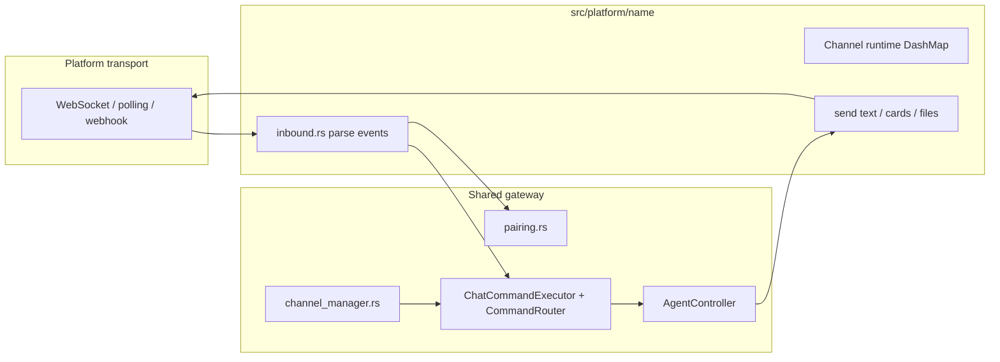

# Adding a New Chat Platform (Bot)

> Back: [CLAUDE.md](../CLAUDE.md). Companion: [Adding a New Agent Provider](adding-agent-provider.md), [Platform Reference Docs](platform-reference.md), [platform-integration-checklist](platform-integration-checklist.md).

Use this checklist when integrating a new chat bot (Feishu/Lark, Telegram, QQ, Discord, Slack, etc.). **Full checklist (do not skip items):** [platform-integration-checklist.md](platform-integration-checklist.md).

Current platforms: **Feishu** (pbbp2 WebSocket + cards), **Telegram** (Bot API long-polling), **QQ** (OpenAPI v2 Gateway WebSocket). Phase 1 **`platform_registry`** (`src/core/config/platform_registry.rs`) drives daemon startup, connection status, `GET /api/platforms`, pairing flags, config restart policy, and `SessionSource` mapping — add a `PlatformDef` entry plus `src/platform/<name>/`. Typed per-platform sections live under **`platforms.<id>`** in `config.json`; WebUI Settings render from `GET /api/platforms` field schema (Phase 2). **Also complete** § [User-facing documentation](../CLAUDE.md#user-facing-documentation-keep-in-sync) and [Platform Reference Docs](platform-reference.md).

## 1. Architecture (what you are building)



**Contract:** implement `Platform` (`run` + `shutdown`). Per-chat state lives in a `*ChannelRuntime` (see `FeishuChannelRuntime`, `TelegramChannelRuntime`). **Do not** reimplement `/agent`, `/cd`, session DB, or agent spawning — route through shared code.

| Layer | Responsibility | Reuse |
|-------|----------------|--------|
| **Transport** | Connect, heartbeat, receive/send API calls | New code per vendor API |
| **Inbound** | Normalize vendor payload → text / callbacks / media | `platform/inbound_media.rs` helpers |
| **Outbound** | Chunk long replies, typing indicators, errors | Copy patterns from Feishu/Telegram constants |
| **Commands** | Slash commands, permissions, agent events | `ChatCommandExecutor`, `CommandRouter`, `EventPollSink` |
| **Sessions** | One `ChannelSession` per chat; optional `AgentSession` | `GLOBAL_CHANNEL_SESSIONS` |
| **Pairing** | Optional admin approval for new chats | `GLOBAL_PAIRING_MANAGER` keyed by `platform` string |

## 2. Choose a connection style

| Style | Reference | When |
|-------|-----------|------|
| **WebSocket + custom framing** | `platform/feishu/ws.rs`, `platform/proto/` | Vendor pushes events over WS (Feishu pbbp2 protobuf) |
| **HTTP long-polling** | `platform/telegram.rs` | Simple Bot API `getUpdates` loop |
| **WebSocket (JSON opcodes)** | `platform/qq/ws.rs` | Vendor Gateway (QQ Bot API v2: Hello / Identify / Dispatch) |
| **Webhook server** | (not in tree yet) | Vendor POSTs to your HTTP endpoint; run handler inside `Platform::run` |

Pick one transport; keep vendor JSON/API types inside `src/platform/<name>/` only.

## 3. Backend checklist (this repo)

| Step | File(s) | What to add |
|------|---------|-------------|
| **A. Config** | `src/core/config/model.rs` | New `XxxConfig { enabled, require_pairing, …credentials }` on `GatewayConfig`; `Default`; `runtime_defaults()` disables it until init. |
| **B. Config save/load** | `src/core/config/loader.rs` | Legacy upgrade in `upgrade_config_json` if you rename fields. |
| **C. Restart policy** | `src/core/config/restart_policy.rs` | `daemon_restart_field_paths()` for `xxx.enabled`, secrets; `live_field_paths()` for `xxx.require_pairing` if it applies without restart; `assess_*` diff functions. |
| **D. Platform module** | `src/platform/<name>/` | `<name>.rs` (module root): `struct XxxPlatform`, `impl Platform`. Submodules typical: `inbound.rs`, `handle.rs` or `ws.rs`, optional `cards.rs` / keyboards for interactive UI. |
| **E. Export** | `src/platform.rs` | `pub mod <name>;` |
| **F. Registry + daemon** | `src/core/config/platform_registry.rs`, `src/daemon/engine.rs` | Add `PlatformDef` to `PLATFORM_DEFS` (spawn fn, pairing flag, restart/live paths, status). `engine.rs` calls `platform_registry::start_enabled_platforms` — do not hand-wire each platform in engine. |
| **G. Connection status** | `src/platform/status.rs` | `set_state` / `get_state` for WebUI sidebar (today: static atoms per platform). |
| **H. Session source** | `src/core/session/channel_model.rs`, `src/database.rs` | `SessionSource` variant + `source_to_str` / `str_to_source` for SQLite. |
| **I. Channel mapping** | `src/core/session/channel_manager.rs` | `get_or_create_platform_channel`: map `platform` string → `SessionSource`. |
| **J. Pairing** | (usually no code) | Use platform id string (`"feishu"`, `"telegram"`) in `require_pairing` / `is_approved` / `get_or_create_pending`. |
| **K. Command bridge** | Platform root (`<name>.rs`) loop | Build `ChatCommandContext` (include `McpContext` when agent can `send_file`); call `session::chat_flow::route_and_execute`; handle `ChatCommandOutcome` (reply, `ListDir`, `SelectAgent`, permission prompts, etc.). |
| **L. Agent events** | Platform poll loop | `core/runtime/event_poller.rs` + `EventPollSink` impl (see `TelegramEventSink`) to stream `AgentEvent` → chat messages. |
| **M. MCP `send_file`** | `src/core/runtime/file_delivery.rs`, `core/runtime/mcp_server.rs`, platform `mcp_context_for_*` | New `McpDeliveryTarget` variant + `FileDelivery` impl; `with_mcp_context` on inbound. Update MCP matrix + `docs/bots/<platform>.md` limits. |
| **N. Deliver bus** | `platform.rs` | `spawn_deliver_listener("<name>", \|chat_id, text\| …)` if WebUI/daemon pushes files into chats. |
| **O. Interactive UX** | e.g. `feishu/cards.rs`, Telegram inline keyboards | Map `ChatCommandOutcome` to platform UI: Feishu cards, Telegram inline keyboards, QQ plain text. Inbound slash commands use shared `route_and_execute` (not pre-intercepted). |
| **P. Web API** | `src/api/web/handlers/config.rs` | Mask secrets in `handle_get_config`; merge body in `handle_save_config`; include in `handle_get_platforms` when `enabled`; extend `handle_set_require_pairing` allowlist. |
| **Q. Init wizard** | `src/core/config/wizard.rs` | `configure_bot_step`: menu entry, enable flag, credential prompts, incomplete warnings. |
| **R. i18n** | `src/utils/i18n/dict.rs` | Prefix `<name>.` for help, errors, shutdown notice, permission titles, command menu labels. |
| **S. Tests** | Same-file `#[cfg(test)]` in platform modules; optional `src/tests/<name>_*.rs` | Card/layout and parsing unit tests stay in the platform `.rs` (e.g. `feishu/cards.rs`, `qq/api.rs`). Use `src/tests/` only for full chat/session flows with mocks; register in `src/tests.rs`. Do not widen visibility on handlers/helpers for unit tests. |
| **T. Platform Reference Docs** | [platform-reference.md](platform-reference.md) | **Required:** add a new `## <Platform>` subsection with console + auth + transport + events + send APIs (table of URLs). Mirror links in `docs/bots/<platform>.md` **References**. |
| **U. User documentation** | See § [User-facing documentation](../CLAUDE.md#user-facing-documentation-keep-in-sync) | **Required:** new `docs/bots/<platform>.md` + `.zh-CN.md`, update `docs/bots/README`, `docs/config`, `docs/usage`, README, `scripts/install-docs.*`. |

**Shared command path (do not fork):** inbound text → `session::chat_flow::route_and_execute` (`CommandRouter::route` + `ChatCommandExecutor::execute`) → `ChatCommandOutcome` → platform/WebUI presentation. Gateway builtins (`/help`, `/agent`, `/cd`, …) live in `core/command/builtin.rs` + `core/session/channel_command.rs`.

## 4. Platform-specific hooks (common)

| Feature | Feishu | Telegram | QQ | Your platform |
|---------|--------|----------|-----|----------------|
| Pairing gate | `require_pairing` + WebUI approve | same | same | Call `GLOBAL_PAIRING_MANAGER` before handling |
| `/ll` directory UI | Interactive card + callbacks | Inline keyboard | Text list | Map `ChatCommandOutcome::ListDir` |
| `/agent` picker | Card buttons `set_agent` | Inline keyboard | Text list | Map `ChatCommandOutcome::SelectAgent` |
| Permission prompts | Card / text + callback | Inline buttons | Text + request id | Map `PermissionRequest` events |
| **MCP `send_file`** | Yes (`FeishuFileTarget`) | Yes (`TelegramFileTarget`) | Yes (`QqFileTarget`, C2C only) | `McpDeliveryTarget` + `with_mcp_context` |
| Shutdown notice | `feishu.shutdown_notice` i18n | `telegram.shutdown_notice` | `qq.shutdown_notice` | Send on daemon `Platform::shutdown` |
| Unknown slash (no session) | `feishu.unknown_command` | Telegram help text | (shared builtins) | Reply with available commands |

## 5. Frontend checklist (`../cc-gateway-webui`)

Platforms are **not** dynamically listed yet (unlike `GET /api/agents`). Expect manual UI updates:

| File | Change |
|------|--------|
| `src/types/index.ts` | `GatewayConfig.<platform>` block; extend `SourceFilter` if sessions should filter by source. |
| `src/components/SettingsModal.tsx` | Enabled toggle, credential fields, `require_pairing` checkbox. |
| `src/components/PairingModal.tsx` | Displays `platform` from API — usually works if backend uses consistent id string. |
| Sidebar / platforms panel | Reads `GET /api/platforms` — ensure `handle_get_platforms` returns your platform when enabled. |
| `src/i18n/en.ts`, `zh.ts` | `settings.<platform>`, any platform-specific copy. |

Pairing REST (`/api/pairing/*`) is platform-agnostic; config save for `require_pairing` uses `POST /api/platforms/require_pairing` (extend backend allowlist in `handle_set_require_pairing`).

## 6. Config shape (for reference)

Bot settings live under **`platforms.<id>`** (not top-level keys). Canonical full file: [config.md](config.md).

```json
{
  "platforms": {
    "feishu": {
      "enabled": true,
      "app_id": "${FEISHU_APP_ID}",
      "app_secret": "${FEISHU_APP_SECRET}",
      "require_pairing": true
    },
    "telegram": {
      "enabled": false,
      "bot_token": "${TELEGRAM_BOT_TOKEN}",
      "require_pairing": true
    },
    "qq": {
      "enabled": false,
      "app_id": "${QQ_APP_ID}",
      "app_secret": "${QQ_APP_SECRET}",
      "sandbox": false,
      "require_pairing": true
    }
  }
}
```

`${VAR}` substitution happens in `config/loader.rs`. Legacy top-level platform keys are migrated into `platforms` on load and **persisted** when the structure changes. Changing `enabled` or bot credentials requires a **daemon restart**; toggling `require_pairing` applies **live** (see `restart_policy`).

## 7. Init wizard (`cc-gateway init`)

`configure_bot_step` in `wizard.rs`: user picks one bot or skips. Only the chosen platform is enabled; credentials are prompted. Incomplete credentials add wizard warnings. Agent step uses `agent_registry::apply_init_agent_enablement` separately.

## 8. Verification

1. `cargo test <platform>_` modules + `config_model` + `restart_policy`.
2. `cc-gateway init` or WebUI: enable platform, save config, restart daemon.
3. WebUI **Pairing**: approve a test chat when `require_pairing` is on.
4. End-to-end: send message → agent reply; `/agent`, `/cd`, `/ll`, `/quit`; permission allow/deny; MCP `send_file` on Feishu/Telegram (skip for QQ until implemented).
5. `GET /api/platforms` shows `connecting` → `connected`; shutdown sends user-visible notice.
6. `./install_local.sh` if WebUI settings changed.
7. **Docs**: § [User-facing documentation](../CLAUDE.md#user-facing-documentation-keep-in-sync) checklist done; **Platform Reference Docs** subsection added; run install (or `print_install_docs`) and confirm the new guide URL appears.

## 9. Naming conventions

- **Platform id string**: lowercase, stable (`feishu`, `telegram`) — used in DB, pairing, `ChannelSession.platform`, `McpDeliveryTarget`, logs.
- **Display name**: `SessionSource` enum + WebUI (`Feishu`, `Telegram`) — user-facing session list filter.
- **i18n prefix**: match platform id (`feishu.`, `telegram.`).

## 10. Future improvement

Register the platform in **`platform_registry.rs`** (`PLATFORM_DEFS`: id, `SessionSource`, transport, capabilities, config hooks, `spawn`). Grep existing `feishu` / `telegram` / `qq` for remaining match arms (WebUI config POST, wizard prompts, MCP delivery, platform module).
